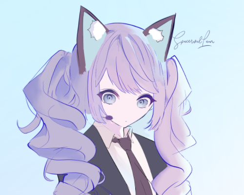

# Desktop Pet



A Live2D desktop pet application built with PyQt5 and OpenGL.

## Features
- Interactive Live2D model that follows mouse cursor
- Customizable size and position
- Multiple expressions (toggle with right-click menu)
- Lock/unlock functionality
- Global hotkey (Ctrl+Space) to hide/show
- Right-click context menu for controls

## Installation

### 1. Standalone Executable (Recommended for regular users)
- Download the latest `demo111.exe` from [Releases] section
- Double-click to run, no dependencies required
- Note: Must download and keep the `model` folder in the same directory

### 2. Source Code Version (For developers/advanced users)
1. Clone repository:
```bash
git clone [repository_url] 
cd [repository_name]
```

2. Install dependencies:
```bash
pip install -r requirements.txt
```

3. Run application:
```bash
python demo111.py
```

### Controls
- Left-click and drag to move
- Mouse wheel to resize
- Right-click for menu:
  - "byebye": Exit
  - "领养说明": Show help
  - "不准动！"/"可以动了": Lock/unlock
  - "藏起来": Hide/show
  - "hate": Toggle expression

## Requirements
- Python 3.6+
- PyQt5
- PyOpenGL
- keyboard
- live2d

## Model Files
Place your Live2D model files in the `model/` directory:
- demomodel.model3.json (main model file)
- texture_00.png (texture)
- expression0.exp3.json (expression 1)
- expression1.exp3.json (expression 2)

## License
Copyright © 2025 SpacervalLam. All rights reserved.

This project is licensed under the [MIT License](LICENSE).
